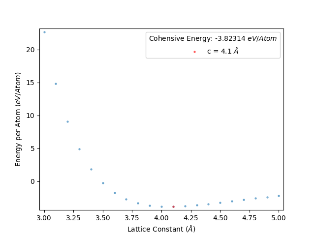
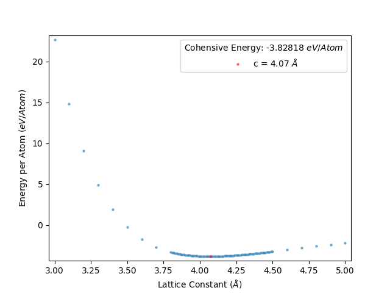
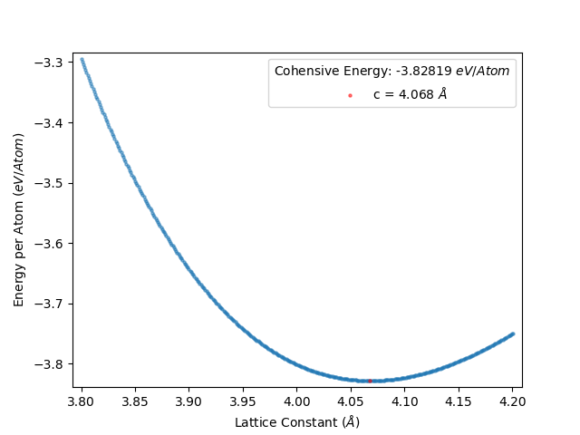
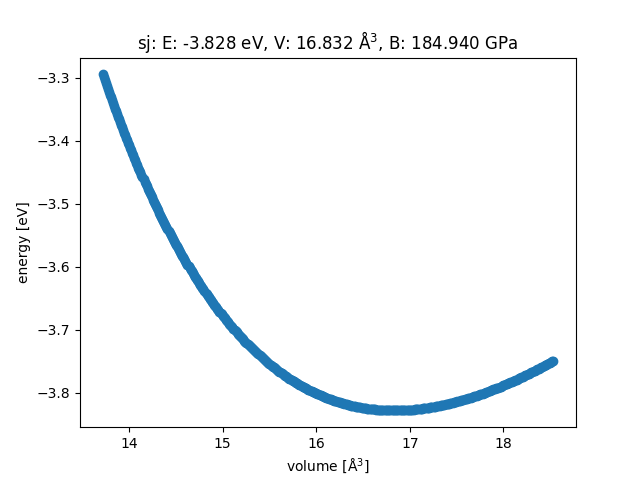
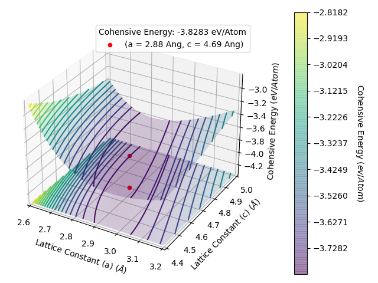
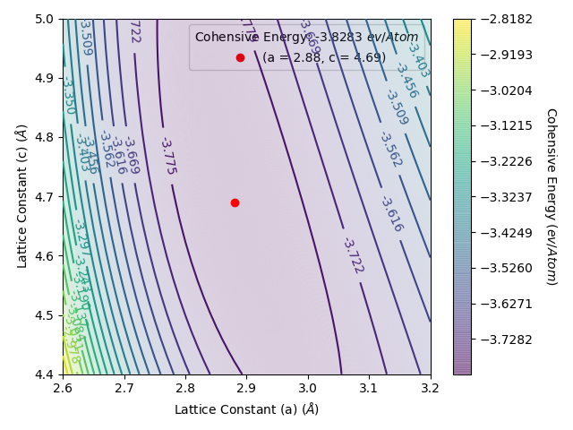

.. _Guide_for_efficienctly_using_LatticeFinder:

A guide for efficiently using LatticeFinder to obtain the optimal lattice constants
###################################################################################

In this article, we will describe how to use LatticeFinder to find the optimal lattice constants for a 2D or 3D system. We will describe how to efficiently use LatticeFinder for systems that contain either one lattice constant or two lattice constants.

2D and 3D Systems containing one lattice constant
*************************************************

1) Performing a broad overview of lattice constants
===================================================

To begin it is often useful to perform a broad overview of lattice constants to determine what lattice constants to focus on. For example, for determining the lattice constant of a Au face-centred cubic (FCC) lattice using the RGL potential, with parameters from Baletto *et al.* (`DOI: 10.1063/1.1448484 <https://doi.org/10.1063/1.1448484>`_). Here, we first look at lattice constants between 3.0 Å and 5.0 Å in increments of 0.1 Å. This is performed with the following ``Run_LatticeFinder.py`` script:

.. literalinclude:: Guide_examples/1_lattice_constant/initial/Run_LatticeFinder.py
	:language: python
	:caption: Run_LatticeFinder.py
	:tab-width: 4
	:linenos:

This gives an energy per atom vs lattice constant plot as below:

From this plot, we see that the minimum centres about 4.1 Å. Therefore, we will want to next perform a comprehensive search of the optimum lattice constant between 4.0 Å and 4.2 Å at the least. This is because we set this script to scan the lattic constants in increments of 0.1 Å, therefore the precise lattice constant will lie within the 4.1 ± 0.1 Å range.

2) Performing a comprehensive scan of lattice constants across a small range
============================================================================

We would like to perform a indepth scan of lattice constants between 4.0 Å and 4.2 Å. We will do this by looking between 4.0 Å and 4.2 Å in increments of 0.001 Å. We can add this indepth scan to our original LatticeFinder calculation by changing the ``Run_LatticeFinder.py`` script to the following:

.. literalinclude:: Guide_examples/1_lattice_constant/zoom_in/Run_LatticeFinder.py
	:language: python
	:caption: Run_LatticeFinder.py
	:tab-width: 4
	:linenos:

You can change the ``lattice_constant_parameters`` input from 

.. literalinclude:: Guide_examples/1_lattice_constant/initial/Run_LatticeFinder.py
	:language: python
	:tab-width: 4
	:lineno-start: 6
	:lines: 6

to 

.. literalinclude:: Guide_examples/1_lattice_constant/zoom_in/Run_LatticeFinder.py
	:language: python
	:tab-width: 4
	:lineno-start: 7
	:lines: 7

and rerun LatticeFinder. LatticeFinder will perform calculations with lattice constants that you have not already obtained. Once you rerun LatticeFinder on your script again, you will get the following energy per atom vs lattice constant plot as below:

This gives an energy per atom vs lattice constant plot as below:

The data from this is shown in ``results_file.txt``

.. include:: Guide_examples/1_lattice_constant/zoom_in/results_file.txt
	:literal:

How to obtain the Bulk Modulus
==============================

In your ``results_file.txt`` you will also be given a value for the bulk modulus. If you want the bulk modulus with a good amount of accurancy, you often need to perform an indepth scan of lattice constants across a good range of data points. Furthermore, the range of lattice constants given must be regular, i.e. incremental. 

For example, we have obtain the energies of an Au FCC crystal for lattice constants between 3.6 Å and 4.6 Å in increments of 0.001 Å. This is given in the ``Run_LatticeFinder.py`` script below:

.. literalinclude:: Guide_examples/1_lattice_constant/zoom_in_bulk_modulus/Run_LatticeFinder.py
	:language: python
	:caption: Run_LatticeFinder.py
	:tab-width: 4
	:linenos:

This gives the following energy per atom vs lattice constant plot:

and the data is given in ``results_file.txt``

.. include:: Guide_examples/1_lattice_constant/zoom_in/results_file.txt
   :literal:

We can see how well the lattice constant and been modelled using a energy vs volume plot given by the ``EOS`` module in ``ASE``

See `Equation of state (EOS) in ASE <https://wiki.fysik.dtu.dk/ase/tutorials/eos/eos.html>`_ for more information.

2D and 3D Systems containing two lattice constant
*************************************************

1) Performing a broad overview of lattice constants
===================================================

Like in the one lattice constant case, it is often useful to perform a broad overview of lattice constants to determine what lattice constants to focus on. For example, for determining the lattice constant of a Au hexagonal closed packed (HCP)  lattice using the RGL potential, with parameters from Baletto *et al.* (`DOI: 10.1063/1.1448484 <https://doi.org/10.1063/1.1448484>`_). Here, we first look at lattice constants for ``c`` between 2.0 Å and 5.0 Å in increments of 0.1 Å, and ``a`` between 3.0 Å and 6.0 Å in increments of 0.1 Å. This is performed with the following ``Run_LatticeFinder.py`` script:

.. literalinclude:: Guide_examples/2_lattice_constant/initial/Run_LatticeFinder.py
	:language: python
	:caption: Run_LatticeFinder.py
	:tab-width: 4
	:linenos:

This gives an energy per atom vs lattice constant plots as below. We have use the ``limits`` section to zoom in on the important area of the potential energy surface to make it easier to see the bottom of the well. 

From this plot, we see that the minimum centres about ``a`` = 2.9 Å and ``c`` = 4.7 Å. Therefore, we will want to next perform a comprehensive search of the optimum lattice constant for ``a`` between 2.8 Å and 3.0 Å and ``c`` between 4.6 Å and 4.8 Å, at the least. This is because we set this script to scan the lattic constants in increments of 0.1 Å, therefore the precise lattice constant will lie within the ``a`` = 2.9 ± 0.1 Å and ``c`` = 4.7 ± 0.1 Å ranges.

2) Performing a comprehensive scan of lattice constants across a small range
============================================================================

We would like to perform a indepth scan of lattice constants between for ``a`` between 2.8 Å and 3.0 Å and ``c`` between 4.6 Å and 4.8 Å in increments of 0.001 Å. Unlike for LatticeFinder calculation for systems with one lattice constant, you can not add data easily to the plots made for systems with two lattice constants and therefore it is best to perform a new LatticeFinder calculation for your system. The ``Run_LatticeFinder.py`` file for running this is shown below: 

.. literalinclude:: Guide_examples/2_lattice_constant/zoom_in/Run_LatticeFinder.py
	:language: python
	:caption: Run_LatticeFinder.py
	:tab-width: 4
	:linenos:

You can change the ``lattice_constant_parameters`` input from 

.. literalinclude:: Guide_examples/2_lattice_constant/initial/Run_LatticeFinder.py
	:language: python
	:tab-width: 4
	:lineno-start: 6
	:lines: 6

to 

.. literalinclude:: Guide_examples/2_lattice_constant/zoom_in/Run_LatticeFinder.py
	:language: python
	:tab-width: 4
	:lineno-start: 6
	:lines: 6

and rerun LatticeFinder. LatticeFinder will perform calculations with lattice constants that you have not already obtained. Once you rerun LatticeFinder on your script again, you will get the following energy per atom vs lattice constant plot as below:

This gives an energy per atom vs lattice constant plots as below:

.. image:: Guide_examples/2_lattice_constant/zoom_in/Energy_Vs_Lattice_Constant_Contour.png
	:width: 700
	:alt: Interpolation Scheme Plot
	:align: center

The data from this is shown in ``results_file.txt``

.. include:: Guide_examples/2_lattice_constant/zoom_in/results_file.txt
	:literal:

